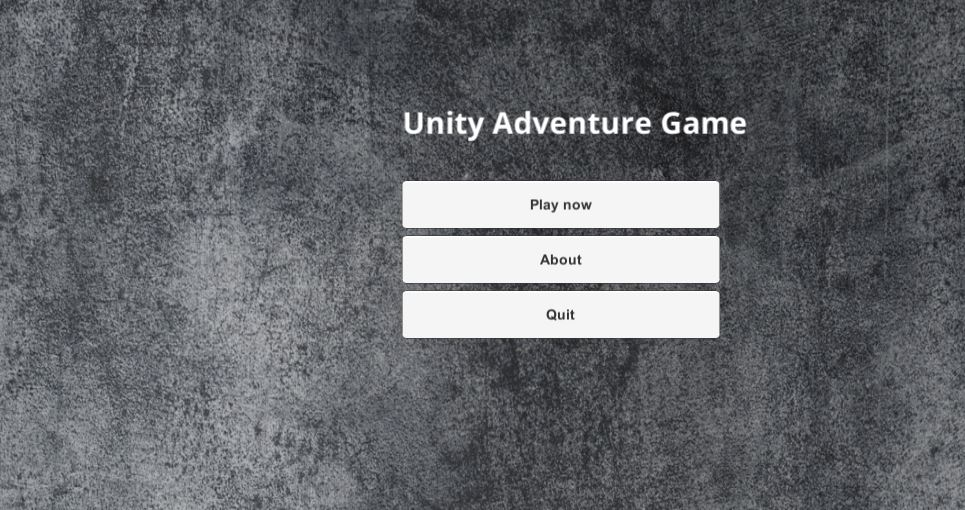

A project related to computer graphics and visualization for educational purposes, a part of this project is:

* To learn how to create scenes in Unity

* To implement C# "scripts" to transform Unity objects with low level matrices (transformation matrices: rotation, scale, translation)

* To learn the basics of Unity API & their components

* To build a game demo
  
  ### 1. My very first unity scene
  

  ### 2. Dummy planetary system with "low level" matrices implementation movement
  https://youtu.be/d723-tgtqII

  

  ### 3. Movable objects
  * https://youtu.be/NXXp_SsAqlU
  * https://youtu.be/Vjmdk56ImqM

  
  
  ### 4. User interface + Gameplay extended
  
  * https://youtu.be/bHvUSWXidTQ
  * https://youtu.be/cDC1pwbgKBs 
  * https://youtu.be/tAy-0KzqGzo
  
Game demo was extended with following:
- Main application view
- Head Up Display (HUD, it does play last picked item)
- Door component which may be opened when there's an suitable apple :) to open it
- Throwable weapon (cube) with fire animation which does reduce health of enemies/players when it hits the collider of Player/Enemy
- Text about current situation in game, which is displayed on the bottom of the screen (about quests/picked items/other informations)
- Text with player name and health points
- Quest which is finished when two specific enemies are killed
- Possibility to save game when players enters the save zone
- Respawning in save zone
- Saving functionality does include serialization(to XML file) of players positions at given point in time and their inventories which consits of items that they have picked up during the game
- Respawning functionality does include deserialization of XML file if game was saved and update of all players positions & inventories

  
