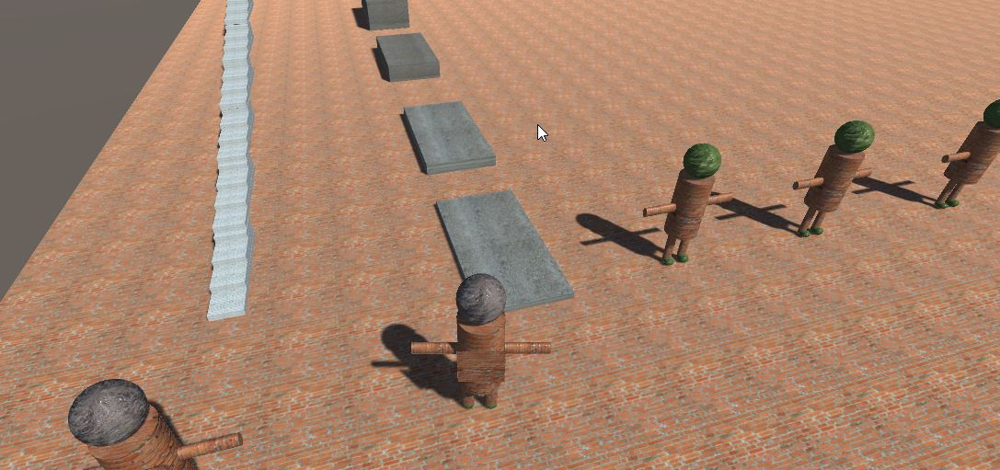

A project related to computer graphics and visualization for educational purposes, a part of this project is:

* To learn how to create scenes in Unity

* To implement C# "scripts" to transform Unity objects with low level matrices (transformation matrices: rotation, scale, translation)

* To learn the basics of Unity API & their components
  
  ### 1. My very first unity scene
  

  ### 2. Dummy planetary system with "low level" matrices implementation movement

  

  ### 3. Moving characters - (1st Game)
  https://youtu.be/NXXp_SsAqlU
  https://youtu.be/Vjmdk56ImqM

  
