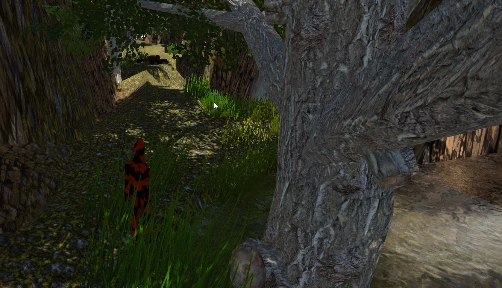
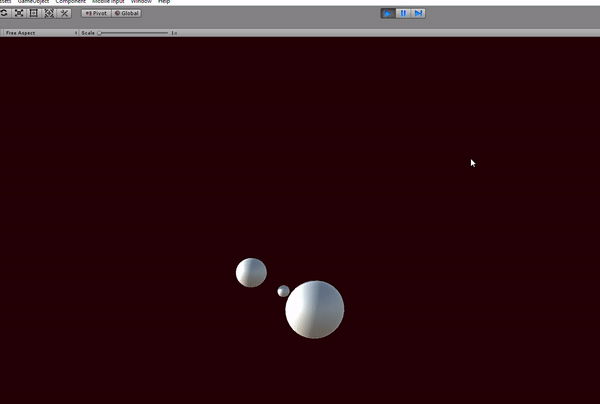

A project related to computer graphics and visualization for educational purposes, a part of this project will be:

* Creation of scenes in Unity

* Implementation of C# scripts to transform unity objects (transformation matrices: rotation, scale, translation)

* Manipulation and use of components provided by Unity

